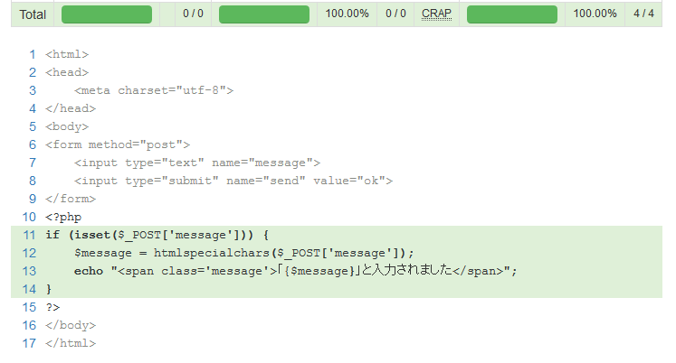
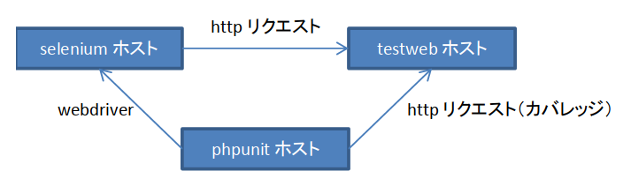

# Selenium と phpunit-selenium で E2Eテスト＆カバレッジ

社内に Selenium サーバを構築したのでその時のメモと簡単な説明を転記します。

## Selenium ってなに？

ggrks.
…だとあんまりなので、簡単に言うとブラウザの操作を自動化してくれるテストツールです。

単純に Selenium っていっても [いろいろ](http://blog.trident-qa.com/2013/05/so-many-seleniums/) あるんですが、
ここでは単純に「Selenium WebDriver」を指すものとします。

## 登場人物

下記の3者が登場します。

- phpunit 実行サーバ
- Selenium サーバ
- Web サーバ

### phpunit 実行サーバ

phpunit の説明は省きますが、 php の WebDriver の実装として `phpunit-selenium` ってのがあります。
他にも Facebook 製の [facebook/webdriver](https://github.com/facebook/php-webdriver) というのもありますが、
これはブラウザ操作に特化していてテスト用ではない、という印象です。
（単純に WebDriver でブラウザ操作をしたいだけならコッチのほうが何かと便利です）。

まぁコードベースでブラウザ操作したいのはほぼテストなんですが、ここではカバレッジを取ることも目的なので `phpunit-selenium` を使います。
`phpunit-selenium` は単純に phpunit を実行した時にブラウザの操作もしてくれるって感じのパッケージです。

私はローカル開発サーバで phpunit を実行するのでこの「phpunit 実行サーバ」とはすなわち localhost を指すものとします。

### Selenium サーバ

4444 ポート（デフォルト）で待ち受け、WebDriver を通じてブラウザの操作を実行します。
実際にブラウザが立ち上がり、勝手にポコポコ操作が動くのはこのサーバになります（Selenium Node とか使わなければ）。

実行には java と各種ブラウザに対応したドライバが必要です。

### Web サーバ

phpunit を実行すると Selenium へリクエストが飛び、ブラウザが起動されますが、そのブラウザが「どこのサーバ(URL)を開くか」を示す必要があります。
簡単にいえばテスト対象の Web アプリです。

-----

上記の3者が必要ですが、全て単一のホストで動かしても全く問題ありません。
例えば「ローカルの Windows で Selenium を動かして 開発用 VM に対して phpunit を実行」でも何ら問題なしです。

ただ、ここでは

- phpunit 実行サーバ → localhost
  - 私の環境だと Windows になります。こいつは以下「phpunit ホスト」と呼称します
- Selenium サーバ → 社内みんなで使う共用サーバ
  - 私の環境だと CentOS7 になります。こいつは以下「selenium ホスト」と呼称します
- テストされる Web サーバ→ 開発用 VM で php の built in web server で起動したもの
  - 私の環境だと CentOS になります。こいつは以下「testweb ホスト」と呼称します

とします。詳細はその都度触れます。

## 環境構築

### phpunit ホスト

プロジェクトの composer.json に下記を加えます。

```json:composer.json
"require-dev": {
  "phpunit/phpunit": "4.*",
  "phpunit/phpunit-selenium": "2.*"
}
```

んで `composer update` で OK です。
テストの書き方は後述します。

なお、 `phpunit-selenium` の1系は Windows 環境でカバレッジが取れない不具合があるので2系を推奨します。

### selenium ホスト

※ java なので Windows でも Linux でも基本的には同じ手順です。適宜読み替えてください
※ ここでは共用環境を想定しているので Linux を前提に記述しています

まず Selenium は java で動くので jdk が必要です。

```bash
yum -y install java-1.7.0-openjdk
```

次に Selenium 本体を入れます。

```bash
wget http://selenium-release.storage.googleapis.com/2.53/selenium-server-standalone-2.53.0.jar
```

これで Selenium の実行自体の準備は整いましたが、ブラウザのドライバがないのでこのままだとブラウザ操作ができません。
X を入れていない CLI 環境にインストールするので、PhantomJS を入れます。

```bash
wget https://phantomjs.googlecode.com/files/phantomjs-1.9.0-linux-x86_64.tar.bz2
tar jxfv phantomjs-1.9.0-linux-x86_64.tar.bz2
cp phantomjs-1.9.0-linux-x86_64/bin/phantomjs /usr/bin/
```

終わったら起動します。

```bash
java -jar selenium-server-standalone-2.53.0.jar -role hub
phantomjs --webdriver=8080 --webdriver-selenium-grid-hub=http://127.0.0.1:4444/
```

これで Selenium 上で PhantomJS がポコポコ（といっても画面がないので見えません）自動で動くようになります。
好みや要件に応じて Firefox や Chrome のドライバも入れると良いでしょう（その場合は X も）。

各種ドライバは[公式サイト](http://www.seleniumhq.org/download/)にあります。

あと本気で運用するなら upstart なり systemd なりで自動起動するようにしといたほうが良いと思います（私はそうしましたが手順は省きます）。

### testweb ホスト

前述のとおり、 php の built in web server で動かします。
開発用 VM などの既に動いている環境でも良いんですが、テスト用にDBを分けたり色々小細工したいのと、共用環境だとデータ整合性の面で不都合があるのでそうしています。

built in web server は php 組み込みで大部分が動作するので設定する部分はごく僅かです。

まず、router スクリプトを書きます。

```php:router.php
$selenium_common = __DIR__ . '/../vendor/phpunit/phpunit-selenium/PHPUnit/Extensions/SeleniumCommon';

// カバレッジリクエストならそれ用のレスポンスを返します
if (preg_match('#^/phpunit_coverage#', $_SERVER["REQUEST_URI"])) {
    include "$selenium_common/phpunit_coverage.php";
    exit;
}

// それ以外は auto_prepend/auto_append の動作を模倣します
include "$selenium_common/prepend.php";
register_shutdown_function(function () use ($selenium_common) {
    include "$selenium_common/append.php";
});

// あとは built in web server の標準の挙動に任せます
return false;
```

ちょっと説明すると、phpunit (with xdebug) はテスト時に実行した行を記録していて、後でコードカバレッジとして確認できるんですが、
いまの状況だと testweb ホストで実行されたコードはカバレッジされません。

なぜか？
冷静に考えると分かりますが、 phpunit を実行しているサーバとテスト用サーバは全くの別物です。
phpunit は webdriver を介して Selenium に Web サーバにアクセスさせているだけで、その Web サーバで実行した行なんか知ったこっちゃないわけです。

`phpunit-selenium` はそこんところがよく考えられていて、 auto_append/prepend を利用してカバレッジ結果を取っておき、そのカバレッジ結果を返す機構が備わっています。
上記はそれを模倣した手抜き処理です。
しっかりやるなら設定ファイルに書くとか起動時の ini 指定とかなんかそういうので対処するべきでしょう（ `-c` オプションでiniが指定できます）。
試したんですが、include_path のせいかうまくカバレッジが取れなかったので router.php で制御しています。
とりあえず上記で動いているのでこの件に関して突き詰めるつもりはありません。

とりあえず実行します。

```bash
php -S 0.0.0.0:3000 -t . router.php
```

でブラウザで `ホスト名:3000` にアクセスして画面が出れば OK です。

これだけだとつまらないので Web アプリも作ります。

```php:app.php
<html>
<head>
    <meta charset="utf-8">
</head>
<body>
<form method="post">
    <input type="text" name="message">
    <input type="submit" name="send" value="ok">
</form>
<?php $message = filter_input(INPUT_POST, 'message', FILTER_SANITIZE_SPECIAL_CHARS) ?>
<span class="message"><?php echo $message ?></span>
</body>
</html>
```

再度ブラウザで `ホスト名:3000/app.php` にアクセスするとそれっぽい画面が出ます。
これは「文字列を入力し送信ボタンをクリックすると次の画面で入力した文字が表示される」という超ステキ Web アプリです。
この Web アプリをテスト対象とします。

## 実際にテストする

以上で環境の準備は完了です。
後はゴリゴリテストを書いていきます。

```php:AppTest.php
class AppTest extends \PHPUnit_Extensions_Selenium2TestCase
{
    public static function browsers()
    {
        $browsers = array(
            array(
                'browserName' => 'phantomjs',
                'host'        => '{SeleniumHost}',
                'port'        => 4444,
            )
        );
        return $browsers;
    }

    public function setUp()
    {
        parent::setUp();

        $this->setBrowserUrl("http://{TestwebHost}:3000/");
        $this->coverageScriptUrl = "http://{TestwebHost}:3000/phpunit_coverage";
    }

    public function test_app()
    {
        // アプリを開きます
        $this->url("/app.php");

        // input[name=message] に「hoge」を入力します
        $this->byName('message')->value('hoge');

        // input[name=send] を押下します
        $this->byName('send')->click();

        // span.message は "「hoge」と入力されました" になっているはずです
        $this->assertEquals("「hoge」と入力されました", $this->byClassName('message')->text());
    }
}
```

色々省いてたり手抜きしてたりしますが、説明は後述するとしてとりあえずテストを実行します。



するとこのようにカバレッジが取れてかつ 100% になっています。

もう一度言いますが、 **この php を実行したのは testweb ホストの php built in server であって、 phpunit ホストではありません。**
にも関わらずカバレッジが取れているのが今回の肝です。

図で表すとこんな感じ。




各種メソッドは下記のような感じです。

### public static function browsers()

テスト対象のブラウザを指定する静的メソッドです。
メソッドじゃなくて、静的プロパティで指定しても同じです。
ただ、Selenium のホスト名や対象ブラウザは phpunit.xml から流し込みたいのでメソッドの方が何かと利便性があります。
可能なら `TestwebHost` も phpunit.xml から流し込みたいところです。

例えばですけど、Selenium 側の実行ブラウザが phantomjs だと、テストがコケた時に何が起きたのかさっぱり分かりません。
キャプチャを撮ったりして工夫はできますけど、やはりローカルで実行させたほうが追いやすいです。
ですので phpunit.xml.dist で Selenium＋phantomjs を指定しておき、コケた場合用に phpunit.xml に手元の Selenium＋firefox などで実行できたほうが便利なわけです。

※ さらに恐ろしいことに Selenium のテストは割りと不安定でコケやすいのです
※ 昔は流しこむどころか phpunit.xml そのもので設定ができたようでした https://github.com/sebastianbergmann/phpunit/issues/1686

### public function setup()

普通の phpunit の setUp と何も変わりません。各テストケースの共通処理を記述します。

`$this->setBrowserUrl` はテスト対象アプリの基底パスを指定…するんだと思います（自信なし）。
`$this->url` で事足りないかなーとも思ったりしてググったら [stackoverflow に同じ質問](http://stackoverflow.com/questions/17731643/what-is-the-difference-in-setbrowserurl-and-url-in-selenium-2-web-driver-for) がありました。

`$this->coverageScriptUrl` はカバレッジ取得URLを指定します。
これもテスト対象アプリのホスト名を指定するためにメソッド内で代入しています。

### public function test_app()

普通の phpunit のテストメソッドです。
細かいことはコメントを参照。

## まとめ

上記で E2Eテスト＋コードカバレッジが出来ました。
シンプルなアプリでしたが、js をふんだんに使用したアプリなどのテストではかなり強力な支援になると思います。

今回は実際に動いている apache や php-fpm などの実行ではなく、 built in server で動かしたのでテスト用の設定や処理などが分離できるのが強みだと思います。
今回のカバレッジ処理もそうですし、例えばログイン機構のある web アプリだとまずログイン処理が必要ですが、`router.php` でセッションをいじってしまえば「常にログイン中」とかにもできますし、
やる気になればリクエストごとに DB を初期化とかも `router.php` で可能なはずです。

そしてそれらのテスト用処理がプロダクション側のコードに一切出現しません。
間違っても「特定の時のみ強制ログイン」とか「特定の時のみDB初期化」なんて処理はプロダクションコードに書きたくないでしょう。

あとは phpunit.xml の書き方やそもそもカバレッジの取り方など、説明が全然足りてないんですが、疲れたので今回はここまでとします。
phpunit.xml の書き方とこの投稿って本質的には関係ないしね。
